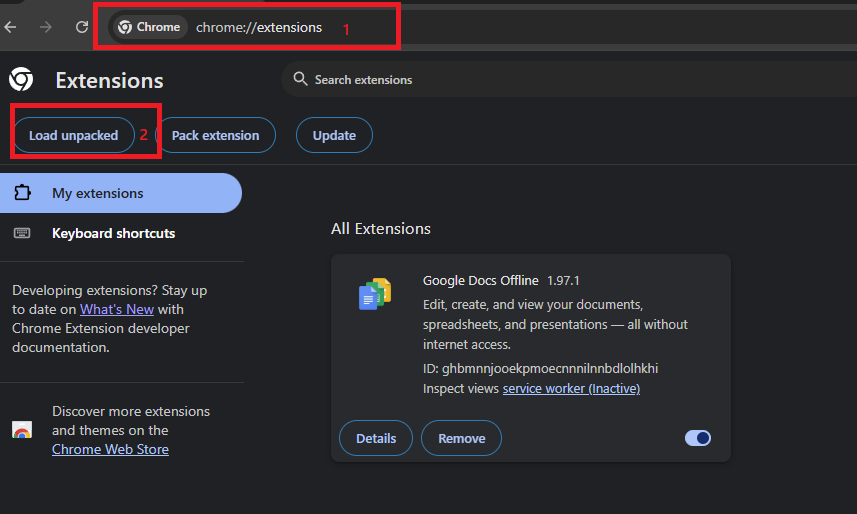
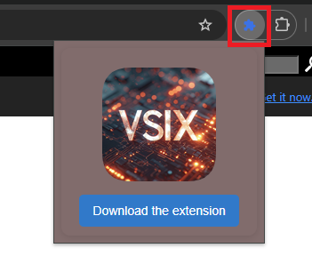

# Vsix-Getter-Chrome-Extension

    

This Chrome extension allows you to **download VSCode extensions** in `.vsix` format directly from the Visual Studio Marketplace. You can easily retrieve extensions without going through the traditional installation process.

---

## Installation

1. **Download the source code** of the extension from this repository.

2. **Navigate to the Chrome Extensions page** by entering `chrome://extensions` in your browser's address bar.

   

      
   

3. **Enable "Developer Mode"** in the top right corner of the Extensions page.

4. **Click "Load unpacked"**, then select the directory containing the extension you just downloaded.

5. **Once the extension is loaded**, you can now use it to download your VSCode extensions in `.vsix` format.

---

## Usage

1. Go to the **Marketplace page** of the VSCode extension you want to download (e.g., [VS Python](https://marketplace.visualstudio.com/items?itemName=ms-python.python)).

    

2. **Click the "Download the extension"** button in the popup window of the Chrome extension to start the download.

3. The `.vsix` file will be downloaded to your default download directory.

---

## CLI Tools 

- **You prefer CLI Tools to get more in once ? **  
You can also download VSCode extensions directly from the Marketplace page using the [VSIX Getter CLI](https://github.com/LGD-P/Vsix-Getter-CLI.git).

